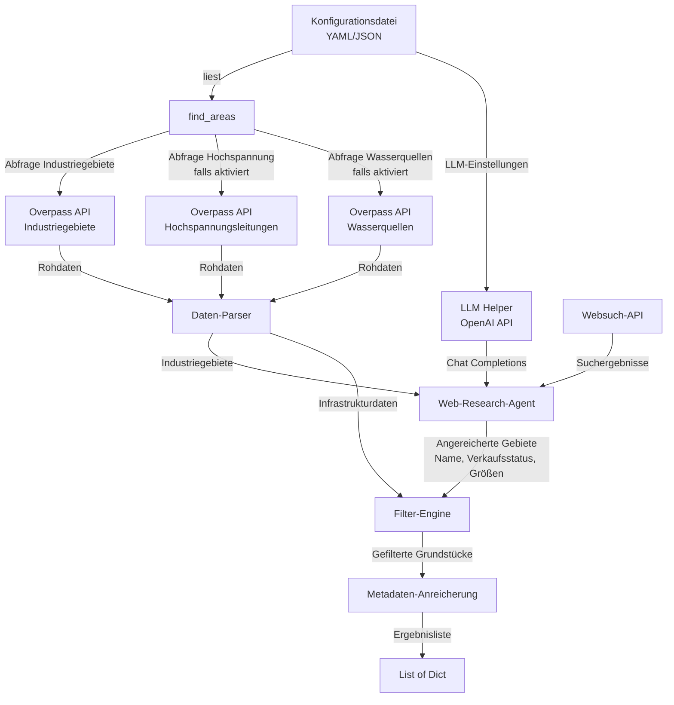
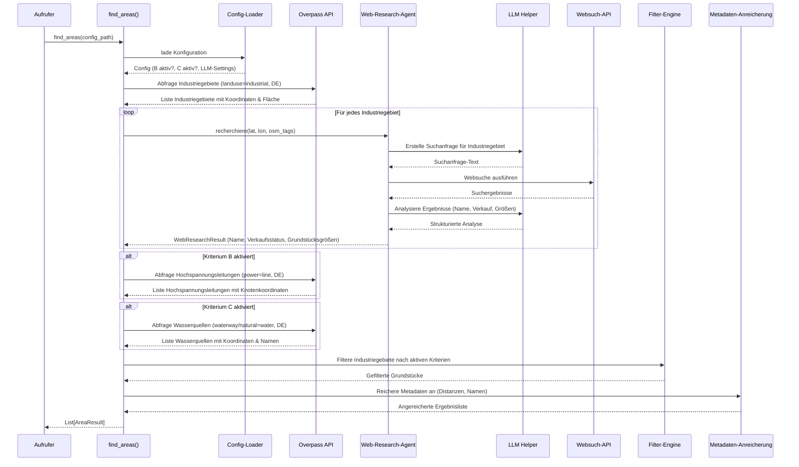
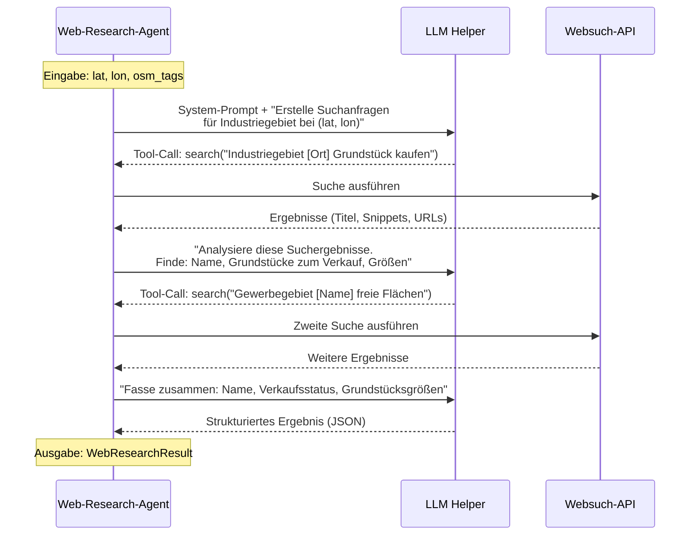

# Design-Dokument: find-areas

## Übersicht

Die Funktion `find_areas` identifiziert potenzielle Grundstücke für Rechenzentren in Deutschland. Sie durchsucht Industriegebiete über die OpenStreetMap Overpass API und nutzt anschließend einen KI-gestützten Web-Research-Agenten, um für jedes Industriegebiet den Namen, verfügbare Grundstücke zum Verkauf und deren Größen zu ermitteln. Die Ergebnisse werden optional nach konfigurierbaren Kriterien gefiltert: Nähe zu Hochspannungsleitungen (< 20 km) und Nähe zu Wasserquellen (< 1 km).

Der Web-Research-Agent basiert auf einem generischen LLM-Helper, der die OpenAI Chat Completions API kapselt. Der Agent orchestriert Websuchaufrufe über das LLM, um Informationen zu Grundstücksverkäufen zu sammeln, die nicht in OSM-Daten enthalten sind. Die Kriterien B (Hochspannungsleitung) und C (Wasserquelle) werden über eine Konfigurationsdatei aktiviert oder deaktiviert. Das Ergebnis ist eine Liste von Dictionaries mit Standortdaten, Grundstücksgröße und relevanten Metadaten.

## Architektur



## Sequenzdiagramm: Hauptablauf




## Sequenzdiagramm: Web-Research-Agent (Detail)



## Komponenten und Schnittstellen

### Komponente 1: Config-Loader

**Zweck**: Liest die Konfigurationsdatei und liefert die aktiven Filterkriterien sowie LLM-Einstellungen.

**Schnittstelle**:
```python
@dataclass
class LLMConfig:
    base_url: str  # OpenAI-kompatible API-URL
    api_key: str  # API-Schlüssel
    model: str  # Modellname (z.B. "gpt-4o-mini")

@dataclass
class FilterConfig:
    proximity_power_line_enabled: bool  # Kriterium B
    proximity_water_source_enabled: bool  # Kriterium C
    max_distance_power_line_km: float  # Standard: 20.0
    max_distance_water_source_km: float  # Standard: 1.0

@dataclass
class AppConfig:
    filter: FilterConfig
    llm: LLMConfig

def load_config(config_path: str) -> AppConfig:
    """Lädt die Konfiguration aus einer YAML/JSON-Datei."""
    ...
```

**Verantwortlichkeiten**:
- Konfigurationsdatei lesen und validieren
- Standardwerte setzen, falls Parameter fehlen
- LLM-Konfiguration (base_url, api_key, model) bereitstellen
- Fehler bei ungültiger Konfiguration melden

### Komponente 2: LLM Helper

**Zweck**: Generischer Wrapper um die OpenAI Chat Completions API. Wird vom Web-Research-Agenten und potenziell weiteren Komponenten genutzt.

**Schnittstelle**:
```python
from typing import Any

class LLMHelper:
    def __init__(self, config: LLMConfig):
        """
        Initialisiert den LLM Helper mit konfigurierbarer
        base_url, api_key und model.
        Nutzt die OpenAI Python-Bibliothek (openai.OpenAI).
        """
        self.client = openai.OpenAI(
            base_url=config.base_url,
            api_key=config.api_key,
        )
        self.model = config.model

    def chat(
        self,
        messages: list[dict[str, str]],
        tools: list[dict] | None = None,
        temperature: float = 0.0,
    ) -> dict:
        """
        Sendet eine Chat-Completion-Anfrage an die OpenAI API.

        Args:
            messages: Liste von Nachrichten (role, content).
            tools: Optionale Tool-Definitionen für Function Calling.
            temperature: Sampling-Temperatur (Standard: 0.0 für deterministische Antworten).

        Returns:
            Die vollständige API-Antwort als Dictionary.
        """
        ...

    def chat_with_tools(
        self,
        messages: list[dict[str, str]],
        tools: list[dict],
        tool_executor: callable,
        max_iterations: int = 5,
    ) -> str:
        """
        Führt eine Tool-Use-Schleife aus:
        1. Sende Nachricht an LLM
        2. Wenn LLM einen Tool-Call zurückgibt, führe Tool aus
        3. Sende Tool-Ergebnis zurück an LLM
        4. Wiederhole bis LLM eine finale Textantwort gibt
           oder max_iterations erreicht ist.

        Args:
            messages: Initiale Nachrichten.
            tools: Tool-Definitionen (OpenAI Function Calling Format).
            tool_executor: Funktion, die Tool-Calls ausführt.
            max_iterations: Maximale Anzahl an Tool-Call-Zyklen.

        Returns:
            Die finale Textantwort des LLM.
        """
        ...
```

**Verantwortlichkeiten**:
- OpenAI-Client mit konfigurierbarer base_url, api_key und model initialisieren
- Chat Completions API aufrufen (mit und ohne Tools)
- Tool-Use-Schleife verwalten (Anfrage → Tool-Call → Ausführung → Antwort)
- Fehlerbehandlung bei API-Fehlern (Rate Limits, Timeouts, ungültige Antworten)
- Retry-Logik bei transienten Fehlern

### Komponente 3: Web-Research-Agent

**Zweck**: Nutzt den LLM Helper, um per Websuche Informationen über Industriegebiete zu sammeln: Name, Grundstücke zum Verkauf und deren Größen.

**Schnittstelle**:
```python
from dataclasses import dataclass

@dataclass
class WebResearchResult:
    area_name: str | None  # Ermittelter Name des Industriegebiets
    has_plots_for_sale: bool  # Ob Grundstücke zum Verkauf stehen
    plot_sizes_sqm: list[float]  # Größen der verfügbaren Grundstücke in m²
    confidence: float  # Konfidenz der Recherche (0.0 - 1.0)
    sources: list[str]  # URLs der genutzten Quellen

class WebResearchAgent:
    def __init__(self, llm: LLMHelper, search_api_key: str | None = None):
        """
        Initialisiert den Agenten mit LLM Helper und optionalem
        API-Schlüssel für die Websuch-API.
        """
        ...

    def research_area(
        self,
        lat: float,
        lon: float,
        osm_tags: dict[str, str] | None = None,
    ) -> WebResearchResult:
        """
        Recherchiert Informationen über ein Industriegebiet.

        Der Agent:
        1. Erstellt über das LLM eine geeignete Suchanfrage
           basierend auf Koordinaten und ggf. vorhandenen OSM-Tags.
        2. Führt Websuchen durch (über Tool-Calling).
        3. Analysiert die Suchergebnisse über das LLM.
        4. Extrahiert Name, Verkaufsstatus und Grundstücksgrößen.

        Args:
            lat: Breitengrad des Industriegebiets.
            lon: Längengrad des Industriegebiets.
            osm_tags: Optionale OSM-Tags (z.B. vorhandener Name).

        Returns:
            WebResearchResult mit den ermittelten Informationen.
        """
        ...

    def _build_system_prompt(self) -> str:
        """Erstellt den System-Prompt für den LLM-Agenten."""
        ...

    def _create_search_tool_definition(self) -> dict:
        """
        Erstellt die Tool-Definition für die Websuche
        im OpenAI Function Calling Format.
        """
        ...

    def _execute_tool_call(self, tool_name: str, arguments: dict) -> str:
        """
        Führt einen Tool-Call aus (z.B. Websuche).
        Wird als tool_executor an LLMHelper.chat_with_tools übergeben.
        """
        ...

    def _parse_result(self, llm_response: str) -> WebResearchResult:
        """Parst die LLM-Antwort in ein strukturiertes WebResearchResult."""
        ...
```

**Verantwortlichkeiten**:
- System-Prompt erstellen, der das LLM anweist, nach Industriegebiet-Informationen zu suchen
- Websuch-Tool als OpenAI Function Call definieren
- LLM-gesteuerte Suchschleife ausführen (LLM entscheidet, was gesucht wird)
- Suchergebnisse durch das LLM analysieren und strukturieren lassen
- Ergebnis in `WebResearchResult` parsen
- Graceful Degradation: Bei Fehlern oder fehlenden Informationen Standardwerte zurückgeben


### Komponente 4: Overpass-Client

**Zweck**: Kommuniziert mit der OpenStreetMap Overpass API und liefert Geodaten.

**Schnittstelle**:
```python
class OverpassClient:
    def query_industrial_areas(self) -> list[dict]:
        """
        Holt alle Industriegebiete in Deutschland.
        Overpass-Query:
          [out:json][timeout:180];
          area["ISO3166-1"="DE"][admin_level=2]->.de;
          (
            way["landuse"="industrial"](area.de);
            relation["landuse"="industrial"](area.de);
          );
          out center tags;
        """
        ...

    def query_power_lines(self) -> list[dict]:
        """
        Holt alle Hochspannungsleitungen in Deutschland.
        Overpass-Query:
          [out:json][timeout:180];
          area["ISO3166-1"="DE"][admin_level=2]->.de;
          (
            way["power"="line"]["voltage"~"110000|220000|380000"](area.de);
          );
          out geom;

        WICHTIG: 'out geom' statt 'out center', damit alle Knoten
        der Leitungswege mit Koordinaten zurückgegeben werden.
        Jeder Way enthält eine Liste von (lat, lon)-Paaren,
        die die Polyline der Leitung bilden.
        """
        ...

    def query_water_sources(self) -> list[dict]:
        """
        Holt alle Wasserquellen (Flüsse, Seen) in Deutschland.
        Overpass-Query:
          [out:json][timeout:180];
          area["ISO3166-1"="DE"][admin_level=2]->.de;
          (
            way["waterway"~"river|canal"](area.de);
            way["natural"="water"](area.de);
            relation["natural"="water"](area.de);
          );
          out center tags;

        Für Flüsse/Kanäle wird 'out center' genutzt, da der
        Mittelpunkt als Näherung ausreicht. Für präzisere
        Berechnung könnte auch 'out geom' verwendet werden.
        """
        ...
```

**Verantwortlichkeiten**:
- Overpass-Queries ausführen mit Timeout-Handling
- JSON-Antworten parsen und in einheitliches Format umwandeln
- Für Hochspannungsleitungen: Vollständige Geometrie (alle Knoten) abrufen
- Für Wasserquellen: Mittelpunkte und Namen abrufen
- Fehlerbehandlung bei API-Timeouts oder Netzwerkfehlern

### Komponente 5: Filter-Engine

**Zweck**: Filtert Industriegebiete anhand der aktiven Distanzkriterien.

**Schnittstelle**:
```python
class FilterEngine:
    def __init__(self, config: FilterConfig):
        ...

    def apply_filters(
        self,
        industrial_areas: list[dict],
        power_lines: list[dict] | None,
        water_sources: list[dict] | None,
    ) -> list[dict]:
        """
        Filtert Industriegebiete nach aktiven Kriterien.
        Kriterium B und C werden nur angewendet, wenn in Config aktiviert.

        Für Hochspannungsleitungen:
        - Berechnet minimale Distanz vom Industriegebiet-Zentrum
          zur nächsten Polyline (Punkt-zu-Polyline-Distanz).
        - Nutzt scipy.spatial.cKDTree für effiziente Suche.

        Für Wasserquellen:
        - Berechnet Haversine-Distanz vom Industriegebiet-Zentrum
          zum nächsten Wasserquellen-Mittelpunkt.
        """
        ...
```

**Verantwortlichkeiten**:
- Distanzberechnung zwischen Koordinaten
- Punkt-zu-Polyline-Distanzberechnung für Hochspannungsleitungen
- Filterung nach Nähe zu Hochspannungsleitungen (< 20 km)
- Filterung nach Nähe zu Wasserquellen (< 1 km)
- Nur aktive Kriterien anwenden

### Komponente 6: Metadaten-Anreicherung

**Zweck**: Reichert gefilterte Grundstücke mit zusätzlichen Metadaten an.

**Schnittstelle**:
```python
class MetadataEnricher:
    def enrich(
        self,
        filtered_areas: list[dict],
        power_lines: list[dict] | None,
        water_sources: list[dict] | None,
        config: FilterConfig,
    ) -> list[AreaResult]:
        """
        Fügt Metadaten hinzu: Distanz zur nächsten Hochspannungsleitung,
        Name der nächsten Wasserquelle, etc.
        """
        ...
```

**Verantwortlichkeiten**:
- Nächste Hochspannungsleitung und Distanz ermitteln (falls Kriterium B aktiv)
- Nächste Wasserquelle und deren Name ermitteln (falls Kriterium C aktiv)
- Ergebnis-Dictionaries zusammenbauen

## Distanzberechnung: Technischer Ansatz

### Überblick

Die Distanzberechnung ist ein zentraler Bestandteil der Filter-Engine. Es gibt zwei unterschiedliche Szenarien:

1. **Punkt-zu-Punkt** (Industriegebiet → Wasserquelle): Haversine-Formel
2. **Punkt-zu-Polyline** (Industriegebiet → Hochspannungsleitung): Projektion auf Liniensegmente

### Hochspannungsleitungen: Koordinaten aus Overpass

Hochspannungsleitungen sind in OSM als `way`-Objekte modelliert. Jeder Way besteht aus mehreren Knoten (Nodes), die zusammen eine Polyline bilden.

**Overpass-Query mit `out geom`**:
```
[out:json][timeout:180];
area["ISO3166-1"="DE"][admin_level=2]->.de;
(
  way["power"="line"]["voltage"~"110000|220000|380000"](area.de);
);
out geom;
```

**Antwortformat**:
```python
# Jeder Way enthält eine geometry-Liste mit allen Knoten
{
    "type": "way",
    "id": 98765432,
    "geometry": [
        {"lat": 51.1000, "lon": 7.5000},
        {"lat": 51.1050, "lon": 7.5100},
        {"lat": 51.1100, "lon": 7.5200},
        # ... weitere Knoten
    ],
    "tags": {
        "power": "line",
        "voltage": "380000"
    }
}
```

Durch `out geom` werden alle Knotenkoordinaten direkt in der Antwort mitgeliefert, ohne dass separate Node-Abfragen nötig sind.

### Punkt-zu-Polyline-Distanz für Hochspannungsleitungen

Die minimale Distanz von einem Industriegebiet-Zentrum zu einer Hochspannungsleitung ist **nicht** einfach die Distanz zum nächsten Knoten der Leitung. Der nächste Punkt kann auf einem Segment zwischen zwei Knoten liegen.

**Algorithmus**:

```python
import numpy as np
from scipy.spatial import cKDTree
from math import radians, cos, sin, asin, sqrt

EARTH_RADIUS_KM = 6371.0

def haversine(lat1: float, lon1: float, lat2: float, lon2: float) -> float:
    """Berechnet die Distanz in km zwischen zwei Punkten auf der Erde."""
    lat1, lon1, lat2, lon2 = map(radians, [lat1, lon1, lat2, lon2])
    dlat = lat2 - lat1
    dlon = lon2 - lon1
    a = sin(dlat / 2) ** 2 + cos(lat1) * cos(lat2) * sin(dlon / 2) ** 2
    return 2 * EARTH_RADIUS_KM * asin(sqrt(a))

def point_to_segment_distance_km(
    px: float, py: float,
    ax: float, ay: float,
    bx: float, by: float,
) -> float:
    """
    Berechnet die minimale Distanz von Punkt P zu Segment AB.

    Ansatz: Projektion auf das Segment in einem lokalen
    kartesischen Koordinatensystem (Equirectangular-Approximation).

    1. Konvertiere lat/lon in lokale x/y-Koordinaten (km)
       relativ zum Punkt P als Ursprung.
    2. Berechne die orthogonale Projektion von P auf AB.
    3. Klemme den Projektionspunkt auf das Segment [A, B].
    4. Konvertiere zurück und berechne Haversine-Distanz.

    Die Equirectangular-Approximation ist für Distanzen < 50 km
    ausreichend genau (Fehler < 0.1%).
    """
    # Lokale Projektion (Equirectangular)
    cos_lat = cos(radians(px))
    # Konvertiere in km-Offsets relativ zu P
    ax_km = (ay - py) * cos_lat * 111.32
    ay_km = (ax - px) * 111.32
    bx_km = (by - py) * cos_lat * 111.32
    by_km = (bx - px) * 111.32

    # Vektor AB und AP
    abx, aby = bx_km - ax_km, by_km - ay_km
    # P ist am Ursprung (0, 0)
    apx, apy = -ax_km, -ay_km

    ab_sq = abx * abx + aby * aby
    if ab_sq == 0:
        # A und B sind identisch → Punkt-zu-Punkt
        return haversine(px, py, ax, ay)

    # Projektionsparameter t, geklemmt auf [0, 1]
    t = max(0.0, min(1.0, (apx * abx + apy * aby) / ab_sq))

    # Nächster Punkt auf dem Segment in lokalen Koordinaten
    nearest_x = ax_km + t * abx
    nearest_y = ay_km + t * aby

    # Zurück in lat/lon
    nearest_lon = py + nearest_x / (cos_lat * 111.32)
    nearest_lat = px + nearest_y / 111.32

    return haversine(px, py, nearest_lat, nearest_lon)

def min_distance_to_power_line(
    area_lat: float,
    area_lon: float,
    power_line_geometry: list[dict],
) -> float:
    """
    Berechnet die minimale Distanz von einem Industriegebiet-Zentrum
    zu einer Hochspannungsleitung (Polyline).

    Iteriert über alle Segmente der Polyline und gibt die
    minimale Punkt-zu-Segment-Distanz zurück.
    """
    min_dist = float("inf")
    nodes = power_line_geometry
    for i in range(len(nodes) - 1):
        dist = point_to_segment_distance_km(
            area_lat, area_lon,
            nodes[i]["lat"], nodes[i]["lon"],
            nodes[i + 1]["lat"], nodes[i + 1]["lon"],
        )
        min_dist = min(min_dist, dist)
    return min_dist
```

### Effiziente Suche mit scipy cKDTree

Bei tausenden Industriegebieten und tausenden Hochspannungsleitungen ist eine naive O(n*m)-Suche zu langsam. Stattdessen wird ein räumlicher Index verwendet:

```python
from scipy.spatial import cKDTree

def build_power_line_index(
    power_lines: list[dict],
) -> tuple[cKDTree, list[tuple[int, int]]]:
    """
    Erstellt einen KDTree-Index über alle Knoten aller
    Hochspannungsleitungen.

    Returns:
        tree: cKDTree mit (lat, lon)-Koordinaten aller Knoten
              (konvertiert in Radiant für konsistente Distanzen).
        node_to_line: Mapping von Knoten-Index zu
                      (Leitungs-Index, Knoten-Position-in-Leitung).
    """
    all_points = []
    node_to_line = []

    for line_idx, line in enumerate(power_lines):
        for node_idx, node in enumerate(line["geometry"]):
            all_points.append([
                radians(node["lat"]),
                radians(node["lon"]) * cos(radians(node["lat"])),
            ])
            node_to_line.append((line_idx, node_idx))

    tree = cKDTree(np.array(all_points))
    return tree, node_to_line

def find_nearest_power_line(
    area_lat: float,
    area_lon: float,
    tree: cKDTree,
    node_to_line: list[tuple[int, int]],
    power_lines: list[dict],
    k: int = 10,
) -> float:
    """
    Findet die minimale Distanz zu einer Hochspannungsleitung.

    Ablauf:
    1. KDTree-Query: Finde die k nächsten Knoten.
    2. Für jeden gefundenen Knoten: Berechne die exakte
       Punkt-zu-Segment-Distanz für das Segment vor und
       nach dem Knoten.
    3. Gib die minimale Distanz zurück.

    Der KDTree arbeitet mit Equirectangular-projizierten
    Koordinaten für schnelle Näherungssuche. Die exakte
    Distanz wird anschließend per Haversine/Projektion berechnet.
    """
    query_point = [
        radians(area_lat),
        radians(area_lon) * cos(radians(area_lat)),
    ]
    _, indices = tree.query(query_point, k=k)

    min_dist = float("inf")
    checked_segments = set()

    for idx in indices:
        line_idx, node_idx = node_to_line[idx]
        geometry = power_lines[line_idx]["geometry"]

        # Prüfe Segment vor dem Knoten
        if node_idx > 0:
            seg = (line_idx, node_idx - 1)
            if seg not in checked_segments:
                checked_segments.add(seg)
                dist = point_to_segment_distance_km(
                    area_lat, area_lon,
                    geometry[node_idx - 1]["lat"],
                    geometry[node_idx - 1]["lon"],
                    geometry[node_idx]["lat"],
                    geometry[node_idx]["lon"],
                )
                min_dist = min(min_dist, dist)

        # Prüfe Segment nach dem Knoten
        if node_idx < len(geometry) - 1:
            seg = (line_idx, node_idx)
            if seg not in checked_segments:
                checked_segments.add(seg)
                dist = point_to_segment_distance_km(
                    area_lat, area_lon,
                    geometry[node_idx]["lat"],
                    geometry[node_idx]["lon"],
                    geometry[node_idx + 1]["lat"],
                    geometry[node_idx + 1]["lon"],
                )
                min_dist = min(min_dist, dist)

    return min_dist
```

### Wasserquellen: Koordinaten und Distanzberechnung

Wasserquellen (Flüsse, Seen, Kanäle) werden über `out center tags` abgefragt. Jede Wasserquelle wird durch ihren Mittelpunkt repräsentiert.

**Distanzberechnung**: Einfache Haversine-Punkt-zu-Punkt-Distanz, da:
- Der Schwellwert nur 1 km beträgt (sehr nah)
- Die Mittelpunkt-Approximation bei dieser Distanz ausreichend genau ist
- Seen und Flüsse als Flächen/Linien modelliert sind, aber der Mittelpunkt eine gute Näherung bietet

```python
def find_nearest_water_source(
    area_lat: float,
    area_lon: float,
    water_sources: list[dict],
) -> tuple[float, str | None]:
    """
    Findet die nächste Wasserquelle und deren Distanz.

    Für kleine Datenmengen reicht eine lineare Suche.
    Bei Bedarf kann auch hier ein cKDTree eingesetzt werden.

    Returns:
        (distanz_km, name_der_wasserquelle)
    """
    min_dist = float("inf")
    nearest_name = None

    for source in water_sources:
        dist = haversine(
            area_lat, area_lon,
            source["center"]["lat"], source["center"]["lon"],
        )
        if dist < min_dist:
            min_dist = dist
            nearest_name = source.get("tags", {}).get("name")

    return min_dist, nearest_name
```

### Zusammenfassung der Distanzberechnungs-Strategie

| Szenario | Methode | Begründung |
|---|---|---|
| Industriegebiet → Hochspannungsleitung | Punkt-zu-Polyline mit cKDTree-Vorfilterung | Leitungen sind Polylines; nächster Punkt liegt oft zwischen Knoten; cKDTree reduziert Suchraum |
| Industriegebiet → Wasserquelle | Haversine Punkt-zu-Punkt | Schwellwert 1 km ist klein; Mittelpunkt-Approximation ausreichend |
| Equirectangular-Projektion | Lokale Approximation für Segment-Projektion | Genauigkeit < 0.1% Fehler bei Distanzen < 50 km in Deutschland |


## Pipeline-Integration: Gesamtablauf

Der Gesamtablauf der `find_areas`-Pipeline ist wie folgt:

```python
def find_areas(config_path: str) -> list[AreaResult]:
    """
    Hauptfunktion: Findet potenzielle Rechenzentrum-Standorte.

    Pipeline:
    1. Konfiguration laden
    2. Industriegebiete aus OSM abfragen
    3. Web-Research-Agent für jedes Gebiet ausführen
    4. Optional: Hochspannungsleitungen abfragen + filtern
    5. Optional: Wasserquellen abfragen + filtern
    6. Metadaten anreichern und Ergebnisse zurückgeben
    """
    # Schritt 1: Konfiguration laden
    config = load_config(config_path)

    # Schritt 2: Industriegebiete aus OSM abfragen
    client = OverpassClient()
    industrial_areas = client.query_industrial_areas()

    # Schritt 3: Web-Research für jedes Industriegebiet
    llm = LLMHelper(config.llm)
    agent = WebResearchAgent(llm)

    for area in industrial_areas:
        result = agent.research_area(
            lat=area["center"]["lat"],
            lon=area["center"]["lon"],
            osm_tags=area.get("tags"),
        )
        area["web_research"] = result

    # Schritt 4 & 5: Distanzfilter anwenden (falls aktiviert)
    power_lines = None
    water_sources = None

    if config.filter.proximity_power_line_enabled:
        power_lines = client.query_power_lines()

    if config.filter.proximity_water_source_enabled:
        water_sources = client.query_water_sources()

    engine = FilterEngine(config.filter)
    filtered = engine.apply_filters(industrial_areas, power_lines, water_sources)

    # Schritt 6: Metadaten anreichern
    enricher = MetadataEnricher()
    return enricher.enrich(filtered, power_lines, water_sources, config.filter)
```

## Datenmodelle

### Modell 1: AppConfig (Gesamtkonfiguration)

```python
from dataclasses import dataclass

@dataclass
class LLMConfig:
    base_url: str = "https://api.openai.com/v1"
    api_key: str = ""
    model: str = "gpt-4o-mini"

@dataclass
class FilterConfig:
    proximity_power_line_enabled: bool = False
    proximity_water_source_enabled: bool = False
    max_distance_power_line_km: float = 20.0
    max_distance_water_source_km: float = 1.0

@dataclass
class AppConfig:
    filter: FilterConfig = FilterConfig()
    llm: LLMConfig = LLMConfig()
```

**Validierungsregeln**:
- `max_distance_power_line_km` muss > 0 sein
- `max_distance_water_source_km` muss > 0 sein
- `llm.api_key` darf nicht leer sein, wenn Web-Research genutzt wird
- `llm.base_url` muss eine gültige URL sein
- `llm.model` darf nicht leer sein

### Modell 2: WebResearchResult

```python
from dataclasses import dataclass, field

@dataclass
class WebResearchResult:
    area_name: str | None = None
    has_plots_for_sale: bool = False
    plot_sizes_sqm: list[float] = field(default_factory=list)
    confidence: float = 0.0
    sources: list[str] = field(default_factory=list)
```

### Modell 3: AreaResult (Rückgabeformat)

```python
from typing import TypedDict, NotRequired

class AreaResult(TypedDict):
    latitude: float
    longitude: float
    area_sqm: float  # Grundstücksgröße in m²
    industrial_area_name: str | None  # Name des Industriegebiets (aus Web-Research)
    has_plots_for_sale: bool  # Ob Grundstücke zum Verkauf stehen
    plot_sizes_sqm: list[float]  # Größen verfügbarer Grundstücke
    research_confidence: float  # Konfidenz der Web-Recherche
    research_sources: list[str]  # Quellen der Web-Recherche
    distance_power_line_km: NotRequired[float]  # Distanz zur Hochspannungsleitung
    water_source_name: NotRequired[str]  # Name der Wasserquelle
    distance_water_source_km: NotRequired[float]  # Distanz zur Wasserquelle
```

### Modell 4: Konfigurationsdatei (YAML-Format)

```yaml
# config.yaml
llm:
  base_url: "https://api.openai.com/v1"
  api_key: "${OPENAI_API_KEY}"  # Aus Umgebungsvariable
  model: "gpt-4o-mini"

filter:
  proximity_power_line:
    enabled: true
    max_distance_km: 20.0
  proximity_water_source:
    enabled: true
    max_distance_km: 1.0
```

### Modell 5: Overpass-Rohdaten

```python
# Industriegebiet (out center tags)
{
    "type": "way",
    "id": 12345678,
    "center": {"lat": 51.1234, "lon": 7.5678},
    "tags": {
        "landuse": "industrial",
        "name": "Industriepark Musterstadt"
    }
}

# Hochspannungsleitung (out geom) – mit allen Knoten
{
    "type": "way",
    "id": 98765432,
    "geometry": [
        {"lat": 51.1000, "lon": 7.5000},
        {"lat": 51.1050, "lon": 7.5100},
        {"lat": 51.1100, "lon": 7.5200}
    ],
    "tags": {
        "power": "line",
        "voltage": "380000"
    }
}

# Wasserquelle (out center tags)
{
    "type": "way",
    "id": 55555555,
    "center": {"lat": 51.2000, "lon": 7.6000},
    "tags": {
        "waterway": "river",
        "name": "Rhein"
    }
}
```

## Fehlerbehandlung

### Fehlerszenario 1: Overpass API Timeout

**Bedingung**: Die Overpass API antwortet nicht innerhalb des Timeouts (180s)
**Reaktion**: `OverpassTimeoutError` wird ausgelöst mit Angabe der fehlgeschlagenen Query
**Wiederherstellung**: Aufrufer kann erneut versuchen; Timeout ist konfigurierbar

### Fehlerszenario 2: Ungültige Konfigurationsdatei

**Bedingung**: Die Konfigurationsdatei existiert nicht oder enthält ungültige Werte
**Reaktion**: `ConfigError` wird ausgelöst mit Beschreibung des Problems
**Wiederherstellung**: Nutzer korrigiert die Konfigurationsdatei

### Fehlerszenario 3: Keine Industriegebiete gefunden

**Bedingung**: Die Overpass-Abfrage liefert keine Ergebnisse
**Reaktion**: Leere Liste wird zurückgegeben (kein Fehler)
**Wiederherstellung**: Nicht nötig – leere Liste ist ein gültiges Ergebnis

### Fehlerszenario 4: Netzwerkfehler

**Bedingung**: Keine Internetverbindung oder Overpass-Server nicht erreichbar
**Reaktion**: `ConnectionError` wird ausgelöst
**Wiederherstellung**: Aufrufer prüft Netzwerkverbindung und versucht erneut

### Fehlerszenario 5: LLM API Fehler

**Bedingung**: OpenAI API gibt Fehler zurück (Rate Limit, ungültiger API-Key, Modell nicht verfügbar)
**Reaktion**: `LLMError` wird ausgelöst mit HTTP-Statuscode und Fehlermeldung
**Wiederherstellung**: Bei Rate Limits: Exponentielles Backoff. Bei ungültigem Key: Nutzer korrigiert Konfiguration.

### Fehlerszenario 6: Web-Research liefert keine Ergebnisse

**Bedingung**: Die Websuche oder LLM-Analyse liefert keine verwertbaren Informationen für ein Industriegebiet
**Reaktion**: `WebResearchResult` mit Standardwerten (area_name=None, has_plots_for_sale=False, confidence=0.0)
**Wiederherstellung**: Nicht nötig – Graceful Degradation. Das Industriegebiet wird trotzdem in der Pipeline weiterverarbeitet.

### Fehlerszenario 7: Websuch-API Fehler

**Bedingung**: Die Websuch-API (z.B. SerpAPI, Google Custom Search) gibt Fehler zurück
**Reaktion**: Fehler wird geloggt, Web-Research für dieses Gebiet wird mit Standardwerten abgeschlossen
**Wiederherstellung**: Graceful Degradation – Pipeline läuft weiter

## Teststrategie

### Unit-Tests

- **Config-Loader**: Testen mit gültigen, ungültigen und fehlenden Konfigurationsdateien; LLM-Config-Validierung
- **LLM Helper**: Testen mit gemockter OpenAI API; Tool-Use-Schleife testen; Fehlerbehandlung (Rate Limits, Timeouts)
- **Web-Research-Agent**: Testen mit gemocktem LLM Helper und gemockter Websuch-API; Parsing der LLM-Antworten
- **Filter-Engine**: Testen der Distanzberechnung (Haversine und Punkt-zu-Polyline) mit bekannten Koordinaten
- **Distanzberechnung**: Testen von `point_to_segment_distance_km` mit bekannten Geometrien (Punkt auf Segment, Punkt am Endpunkt, Punkt senkrecht zum Segment)
- **Metadaten-Anreicherung**: Testen der korrekten Zuordnung von Infrastrukturdaten zu Grundstücken

### Property-Based Tests

**Property-Test-Bibliothek**: hypothesis

- Alle zurückgegebenen Grundstücke haben gültige Koordinaten (Latitude: -90 bis 90, Longitude: -180 bis 180)
- Wenn Kriterium B aktiv: Alle Grundstücke haben `distance_power_line_km` < konfigurierter Schwellwert
- Wenn Kriterium C aktiv: Alle Grundstücke haben `distance_water_source_km` < konfigurierter Schwellwert
- Wenn Kriterium B deaktiviert: Kein Grundstück enthält `distance_power_line_km`
- Wenn Kriterium C deaktiviert: Kein Grundstück enthält `water_source_name`
- Die Ergebnisliste ist nie größer als die Eingabeliste der Industriegebiete
- Haversine-Distanz ist immer >= 0 und symmetrisch: haversine(A, B) == haversine(B, A)
- Punkt-zu-Segment-Distanz ist immer <= Distanz zu beiden Endpunkten des Segments
- WebResearchResult hat immer confidence im Bereich [0.0, 1.0]

### Integrationstests

- End-to-End-Test mit gemockter Overpass API, gemocktem LLM und gemockter Websuch-API
- Test mit verschiedenen Konfigurationskombinationen (B an/aus, C an/aus)
- Test mit leeren API-Antworten
- Test der vollständigen Pipeline: OSM → Web-Research → Filter → Anreicherung

## Performance-Überlegungen

- Die Overpass-Abfrage für ganz Deutschland kann große Datenmengen liefern; Timeout auf 180s gesetzt
- **Hochspannungsleitungen**: `out geom` liefert deutlich mehr Daten als `out center`; cKDTree-Index reduziert die Suchkomplexität von O(n*m) auf O(n*log(m))
- **Web-Research**: Jeder LLM-Aufruf dauert 1-5 Sekunden; bei vielen Industriegebieten kann dies zum Flaschenhals werden. Mögliche Optimierungen:
  - Parallelisierung der Web-Research-Aufrufe (z.B. mit `asyncio` oder `concurrent.futures`)
  - Vorfilterung: Nur Industriegebiete recherchieren, die die Distanzkriterien erfüllen (falls B/C aktiv)
  - Caching: Ergebnisse der Web-Recherche zwischenspeichern
- Ergebnisse der Overpass-Abfragen könnten gecacht werden, da sich Geodaten selten ändern

## Sicherheitsüberlegungen

- **API-Schlüssel**: Der OpenAI API-Key und ggf. der Websuch-API-Key sollten über Umgebungsvariablen bereitgestellt werden, nicht direkt in der Konfigurationsdatei
- **LLM-Prompt-Injection**: Der System-Prompt des Web-Research-Agenten sollte robust gegen Injection-Versuche aus Websuchergebnissen sein
- **Rate Limiting**: Sowohl die OpenAI API als auch die Websuch-API haben Rate Limits; die Implementierung muss diese respektieren

## Abhängigkeiten

- **requests**: HTTP-Client für Overpass API Aufrufe
- **openai**: OpenAI Python-Bibliothek für Chat Completions API
- **PyYAML**: Konfigurationsdatei parsen
- **math** (Standardbibliothek): Haversine-Distanzberechnung
- **numpy**: Array-Operationen für Koordinatenverarbeitung
- **scipy**: cKDTree für effiziente räumliche Nächste-Nachbar-Suche
- **Websuch-API-Client** (z.B. `serpapi`, `google-api-python-client`): Für die Websuche des Research-Agenten

## Correctness Properties

*Eine Property ist eine Eigenschaft oder ein Verhalten, das für alle gültigen Ausführungen eines Systems gelten sollte – im Wesentlichen eine formale Aussage darüber, was das System tun soll. Properties dienen als Brücke zwischen menschenlesbaren Spezifikationen und maschinenverifizierbaren Korrektheitsgarantien.*

### Property 1: Konfiguration Round-Trip mit Standardwerten

*Für jede* gültige Konfigurationsdatei (auch mit fehlenden optionalen Parametern) soll das Laden über den Config_Loader ein AppConfig-Objekt erzeugen, bei dem alle explizit gesetzten Werte erhalten bleiben und alle fehlenden Parameter korrekte Standardwerte erhalten.

**Validates: Requirements 1.1, 1.2**

### Property 2: Ungültige Konfiguration wird abgelehnt

*Für jede* Konfigurationsdatei mit ungültigen Werten (max_distance_power_line_km <= 0, max_distance_water_source_km <= 0, ungültige base_url oder leerer model-String) soll der Config_Loader einen ConfigError auslösen.

**Validates: Requirements 1.3, 1.4, 1.5**

### Property 3: Overpass-Antwort-Parsing liefert Koordinaten und Tags

*Für jede* gültige Overpass-JSON-Antwort mit Industriegebieten soll der Parser für jedes Element die Zentrumskoordinaten (lat, lon) und die vorhandenen Tags extrahieren.

**Validates: Requirement 2.2**

### Property 4: WebResearchResult ist immer gültig

*Für jede* Web-Recherche (unabhängig von LLM-Antwort oder Suchfehlern) soll das zurückgegebene WebResearchResult einen confidence-Wert im Bereich [0.0, 1.0] enthalten und alle Pflichtfelder (area_name, has_plots_for_sale, plot_sizes_sqm, sources) besitzen.

**Validates: Requirements 3.2, 3.8**

### Property 5: Tool-Use-Schleife terminiert

*Für jede* Sequenz von LLM-Antworten (auch wenn das LLM endlos Tool-Calls zurückgibt) soll die Tool-Use-Schleife des LLM_Helper nach maximal max_iterations Zyklen terminieren.

**Validates: Requirements 3.4, 10.4**

### Property 6: Hochspannungsleitungs-Filter hält Schwellwert ein

*Für jede* Menge von Industriegebieten und Hochspannungsleitungen, wenn Kriterium_B aktiviert ist, sollen alle Gebiete in der Ergebnisliste eine minimale Distanz zur nächsten Hochspannungsleitung haben, die kleiner als der konfigurierte Schwellwert ist.

**Validates: Requirement 4.5**

### Property 7: Wasserquellen-Filter hält Schwellwert ein

*Für jede* Menge von Industriegebieten und Wasserquellen, wenn Kriterium_C aktiviert ist, sollen alle Gebiete in der Ergebnisliste eine minimale Distanz zur nächsten Wasserquelle haben, die kleiner als der konfigurierte Schwellwert ist.

**Validates: Requirement 5.3**

### Property 8: Deaktivierte Kriterien erzeugen keine Felder

*Für jede* Konfiguration, in der Kriterium_B deaktiviert ist, soll kein AreaResult ein distance_power_line_km-Feld enthalten. Analog soll bei deaktiviertem Kriterium_C kein AreaResult ein water_source_name- oder distance_water_source_km-Feld enthalten.

**Validates: Requirements 6.2, 6.3**

### Property 9: Filterung reduziert nur

*Für jede* Eingabeliste von Industriegebieten und jede Filterkonfiguration soll die Ergebnisliste der Filter_Engine nie mehr Elemente enthalten als die Eingabeliste.

**Validates: Requirement 6.4**

### Property 10: AreaResult enthält alle erforderlichen und bedingten Felder

*Für jedes* gefilterte Grundstück soll der Metadaten_Enricher ein AreaResult mit allen Pflichtfeldern (latitude, longitude, area_sqm, industrial_area_name, has_plots_for_sale, plot_sizes_sqm, research_confidence, research_sources) erzeugen. Wenn Kriterium_B aktiv ist, soll distance_power_line_km enthalten sein. Wenn Kriterium_C aktiv ist, sollen water_source_name und distance_water_source_km enthalten sein.

**Validates: Requirements 7.1, 7.2, 7.3**

### Property 11: Haversine-Distanz ist symmetrisch und nicht-negativ

*Für alle* Koordinatenpaare (A, B) soll gelten: haversine(A, B) == haversine(B, A) und haversine(A, B) >= 0.

**Validates: Requirements 8.3, 8.4**

### Property 12: Punkt-zu-Segment-Distanz ist minimal

*Für jeden* Punkt P und jedes Segment [A, B] soll die berechnete Punkt-zu-Segment-Distanz kleiner oder gleich der Distanz von P zu A und der Distanz von P zu B sein.

**Validates: Requirement 8.5**

### Property 13: Pipeline-Ausgabe hat gültige Koordinaten

*Für jedes* AreaResult in der Pipeline-Ausgabe sollen die Koordinaten gültig sein: Latitude im Bereich [-90, 90] und Longitude im Bereich [-180, 180].

**Validates: Requirement 9.3**
